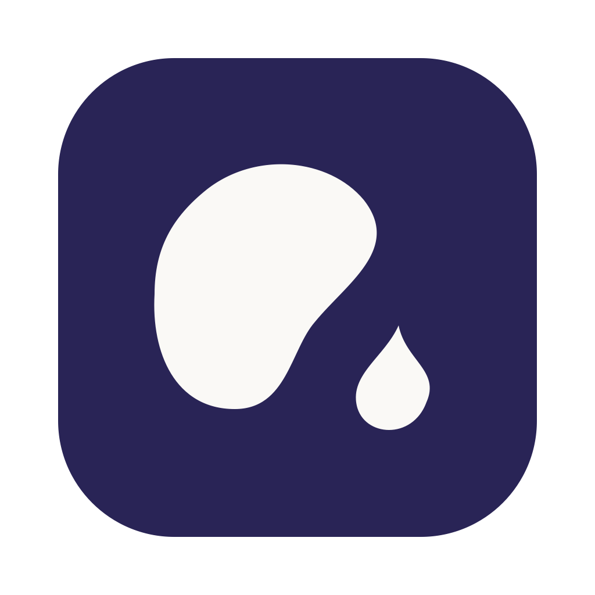
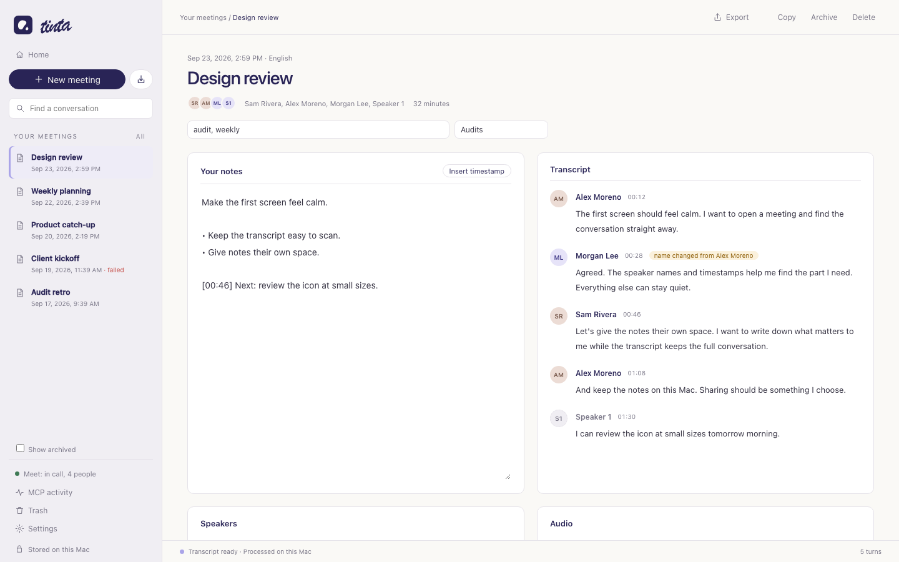
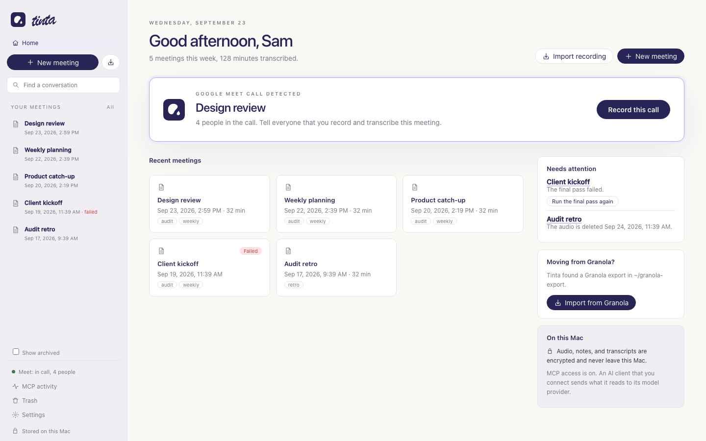
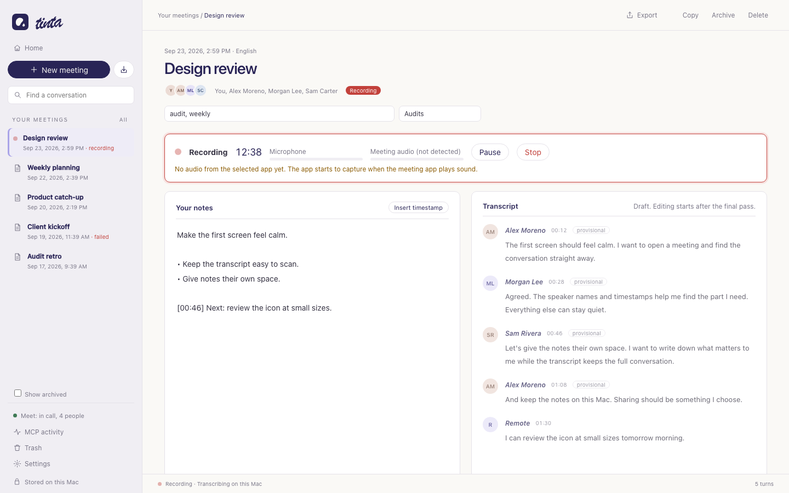
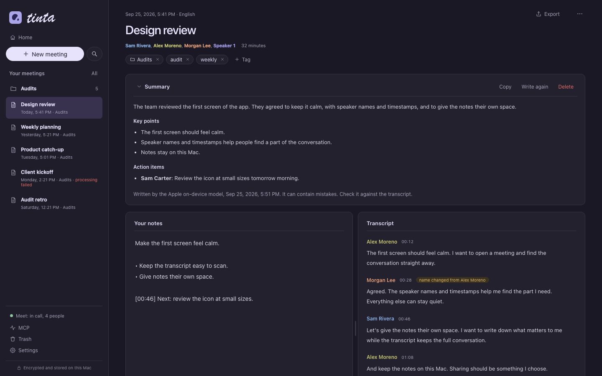
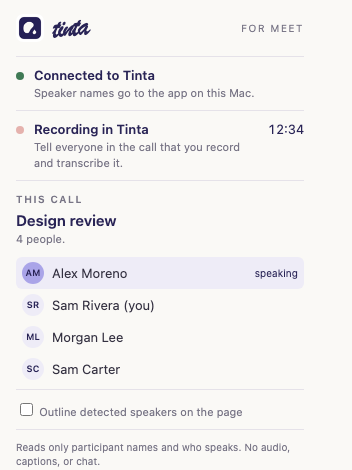
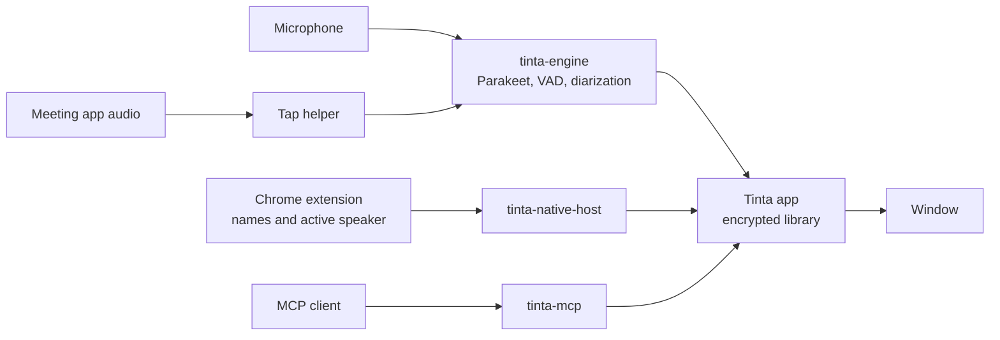

<p align="center">
  
</p>

<h1 align="center">Tinta</h1>

<p align="center"><strong>Meeting notes. On your Mac.</strong><br>
Write your notes, get a transcript with speaker names, and keep everything on your own computer.</p>

> [!NOTE]
> Tinta is in active development. Expect bugs and changes. All feedback is welcome. To report a bug or suggest an improvement, [open an issue](https://github.com/pepebndc/tinta/issues).

<p align="center">
  
</p>

## What Tinta does

- **Notes and transcript side by side.** Write your notes while the draft transcript appears. Insert a timestamp with one click.
- **Local transcription.** Parakeet v3 runs on the Apple Neural Engine. It supports English, Spanish, and 23 other European languages. Tinta detects the language.
- **Speaker names.** Tinta separates the voices. On Google Meet, a small Chrome extension reads who speaks, and Tinta names each speaker. You can confirm, correct, merge, or split speakers.
- **Local summaries.** After a call, the Apple on-device model writes a summary from your notes and the transcript: an overview, key points, decisions, and action items. It runs on your Mac.
- **Your library.** Search, folders, tags, and export to Markdown, JSON, SRT, and VTT.
- **Import from Granola.** Bring your Granola export into Tinta, with notes, transcripts, and speaker names.
- **MCP server.** Connect Claude or another MCP client to your meetings when you choose to.

Tinta has no chat and no cloud AI. The transcription, the speaker separation, and the summaries run on your Mac.

## Privacy by design

| | |
|---|---|
| **Processing** | Transcription and speaker separation run on your Mac. Tinta has no server and no cloud service. |
| **Network** | Tinta downloads the speech models once, when you click Install. After that, it makes no network requests: no analytics, no crash reports, and no update checks. |
| **Storage** | SQLCipher encrypts the library, and AES-GCM encrypts the audio. The key is in your macOS Keychain. Time Machine does not back up the library. |
| **Audio** | Tinta deletes the audio 7 days after a meeting. You can keep it for up to 30 days, or delete it at once. |
| **Summaries** | The Apple on-device model writes the summaries. Tinta does not use Private Cloud Compute or any other server. A summary can contain mistakes, so check it against the transcript. |
| **Browser** | The Meet extension reads only participant names, who speaks, and whether your microphone is muted. It does not read captions, chat, or audio. |
| **MCP** | MCP access is local. An AI client that reads your meetings sends that content to its own model provider. Tinta records every MCP change, so you can undo it. |

Tinta does not tell other people in a call that you record. Always tell them.

## Screenshots

| Home | Recording |
|---|---|
|  |  |

| Dark appearance | Chrome extension |
|---|---|
|  |  |

## Status

Tinta is a pilot. The final pass, the library, the Granola import, and MCP work in tests. Live capture works in local tests, and the first real meetings are in progress. Expect rough edges, and export the meetings that matter.

## Requirements

- A Mac with Apple Silicon (M1 or newer) and macOS 14.2 or later. 16 GB of memory is recommended.
- Google Chrome, for speaker names on Google Meet.
- macOS 26 or later with Apple Intelligence turned on, for summaries. Summaries support English, Spanish, and the other Apple Intelligence languages.
- About 1 GB of free disk space for the app and the speech models.

## Install

Tinta has no signed download yet. Build it from source:

1. Install the Xcode Command Line Tools, Rust, Node.js 20 or later, and pnpm.
2. Clone this repository.
3. Run `./scripts/build.sh`.
4. Move `target/release/bundle/macos/Tinta.app` to your Applications folder.
5. Open Tinta. macOS blocks apps without Apple notarization. Open System Settings, then Privacy & Security, and click **Open Anyway**.
6. If macOS asks whether Tinta can use its key in the Keychain, click **Always Allow**.

## Set up

When you open Tinta for the first time, a short setup guides you through these steps. You can skip each step, or skip all of setup. Steps that you skip stay on Home, under Get ready. To see the setup again, open Settings and click **Run setup again**.

1. **Your name and appearance.** Tinta uses your name for your microphone in the transcript.
2. **Speech models.** Click **Install models**. Tinta downloads about 500 MB at pinned revisions and checks each file against its SHA-256 hash. The download continues if you go to the next step.
3. **Microphone.** Click **Allow microphone**. macOS asks for the audio of other apps at the first recording.
4. **Chrome extension.** Click **Show extension folder**. Tinta puts the extension in a "Chrome extension" folder and shows it in Finder. Open `chrome://extensions` in Chrome, turn on Developer mode, and drag the folder onto the page. Restart Chrome. The setup shows when the extension connects.

## Use

**Record a Google Meet call.** Join the call in Chrome. Home shows "Google Meet call detected". Tell everyone that you record, then click **Record this call**.

**Record other apps.** Click **New meeting**, select the app under "Meeting audio" (for example Zoom), and click **Start recording**. Speakers get automatic names on Google Meet only. On other apps, you name them after the call.

**Headphones or speakers.** Tinta selects the echo handling from your sound output. With speakers, it removes the echo of the call from your microphone. With headphones, it records your microphone directly. Headphones give the best transcript.

**Mute in Meet.** When you mute your microphone in Meet, Tinta does not record your microphone. It records it again when you unmute.

**End of the call.** When you leave the Meet call or close its tab, Tinta stops the recording 3 seconds later. If you rejoin in that time, the recording continues. Turn this off in Settings, under Google Meet extension.

**While you record.** You can open other meetings, Home, or Settings. The recording, the live transcript, and the final pass continue.

**Notes and transcript.** The notes and the transcript fill the window. On a tall or narrow window, the notes show above the transcript. Drag the divider between them to change their size. Double-click the divider to reset it.

**After the call.** Tinta runs a final pass on your Mac. The final pass improves the text and matches speaker names. Play a sample of each speaker, correct names, and edit the transcript. Your notes stay separate from the transcript.

**Summaries.** After the final pass, Tinta writes a summary above the notes. Your notes show what is important to you, so the summary uses them with the transcript. Click **Write again** after you correct names or text, or **Write a summary** for an older meeting. To write summaries only when you ask, turn off "Write a summary after each call" in Settings.

**Import from Granola.** Export your Granola meetings to a folder, then click **Import from Granola** on Home. Granola transcripts have no timestamps and no audio. Delete the export folder after the import, because it is not encrypted.

## Connect an MCP client

Settings shows the configuration. For Claude Desktop, add:

```json
{
  "mcpServers": {
    "tinta": { "command": "/Applications/Tinta.app/Contents/MacOS/tinta-mcp" }
  }
}
```

For Claude Code, run `claude mcp add tinta /Applications/Tinta.app/Contents/MacOS/tinta-mcp`.

Tinta must be open. The tools can list, search, and read meetings, including notes, transcripts, and summaries. They can also change titles, tags, folders, notes, summaries, speaker names, and transcript text.

Each meeting has an ID. To give a meeting to an AI client, click **ID · Copy** next to the date of the meeting, and paste the ID in the client. The first 8 characters of the ID are enough when they are unique. Deletions through MCP go to a 7-day trash. **MCP activity** in the sidebar lists every request and lets you undo each change.

Meeting text can contain instructions from other people. Do not let an AI client act on them.

## How it works



| Component | Path | Role |
|---|---|---|
| App | `app/` | Tauri 2 window with a React interface. It owns the encrypted library, name matching, retention, and the app socket. |
| Core | `crates/tinta-core` | Storage, keys, name matching, export, the Granola import, and the MCP tools. |
| Engine | `engine/` | Swift process for capture, encrypted audio chunks, and the speech models through FluidAudio. |
| MCP server | `crates/tinta-mcp` | MCP over stdio. It forwards tool calls to the running app. |
| Native host | `crates/tinta-native-host` | Chrome Native Messaging host for the Meet extension. |
| Extension | `extension/` | Reads Meet participants and active speakers. See its [README](extension/README.md). |

The helper binaries connect to the app over a private Unix socket. The app accepts only the signed helpers inside its own bundle.

## Speech models

| Model | Use | License |
|---|---|---|
| [Parakeet TDT 0.6B v3](https://huggingface.co/nvidia/parakeet-tdt-0.6b-v3) by NVIDIA, [Core ML conversion](https://huggingface.co/FluidInference/parakeet-tdt-0.6b-v3-coreml) by FluidInference | Transcription | CC-BY-4.0 |
| [Silero VAD](https://huggingface.co/FluidInference/silero-vad-coreml) | Voice activity detection | MIT |
| [pyannote Community-1](https://huggingface.co/pyannote/speaker-diarization-community-1), [Core ML conversion](https://huggingface.co/FluidInference/speaker-diarization-coreml) by FluidInference | Speaker separation | CC-BY-4.0 |

This repository does not include the models. Tinta downloads them at pinned revisions and checks every file against the hashes in `engine/Sources/TintaEngine/ModelManifest.swift`.

## Development

| Task | Command |
|---|---|
| Unit tests | `cargo test --workspace` |
| Extension tests | `node --test extension/test/speaking.test.mjs` |
| End-to-end self-test | `TINTA_DATA_DIR=$(mktemp -d) cargo run -p tinta-selftest` |
| Interface preview with sample data | `cd app && pnpm preview:mock`, then open `app/dist-mock/index.html` |
| App bundle | `./scripts/build.sh` |

The self-test builds a synthetic meeting with the macOS voices. It runs the final pass, name matching, export, the MCP tools, undo, the trash, and audio retention. It uses its own data folder and does not touch your library. Install the speech models before you run it.

The interface preview accepts these views after `index.html`: `#setup`, `#meeting`, `#recording`, `#settings`, `#onboarding` (with the intro), and `#onboarding-welcome`, `#onboarding-models`, `#onboarding-microphone`, `#onboarding-meet`, or `#onboarding-done`. Production builds do not include the sample data.

See the [test guide](docs/TESTING.md) for a first real meeting.

## Known limits

- The app has no Developer ID signature or Apple notarization yet.
- The extension installs unpacked. It is not in the Chrome Web Store yet.
- Speaker names come from the Meet page. When Google changes the page, names can stop until the extension gets an update.
- A Meet room device shows as one participant, so Tinta cannot name the people in the room.
- Tinta records the macOS default microphone.
- With speakers, other audio plays a little quieter during a recording.

## License

Apache-2.0. See [LICENSE](LICENSE) and [NOTICE](NOTICE). The speech models have their own licenses, listed above.
